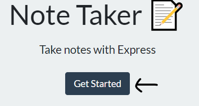
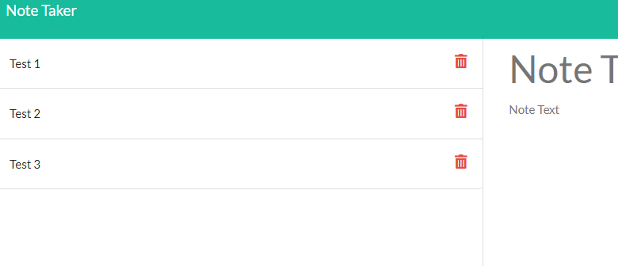
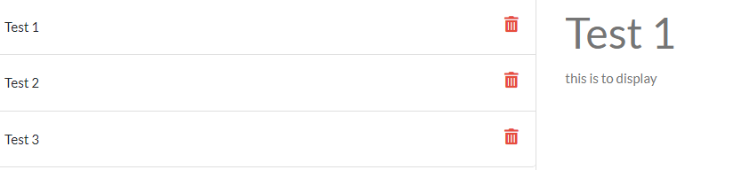
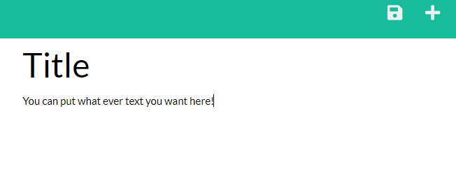

# Note-Taker

## Descrtiption
This application allows users to create notes that will be saved to a json file. The saved notes will display on the left side of the screen when saved and be populated upon return to the application.
## Installation
No installation is necessary in order to use the application. Simply visit this [link](https://janotetaker.herokuapp.com/) in order to view the deployed application online.
## Usage
Upon following the link above you will be brought to a landing page. Click the 'Get Started' button in order to be taken to the notes section.

Onces you are at the /notes endpoint if there are any saved notes in the json file they will appear in the left column.

Clicking on a note like 'Test 1' in the image above will populate the note to the right side of the webpage allowing you to read the text inside of the note.

In the top right of the webpage there is a plus sign then when clicked will open an empty note area which will allow you to create a new note with a Title and text. Once you enter a title and text into the new note a save button will appear just to the left of the plus sign. Clicking the save button will cause the note to be saved to the json file and populate the new note to the left column

If you decide you want to delete a saved note simply click the red trash can on a saved note. This will delete the note from the json file and remove it from the left column.
## License
N/A